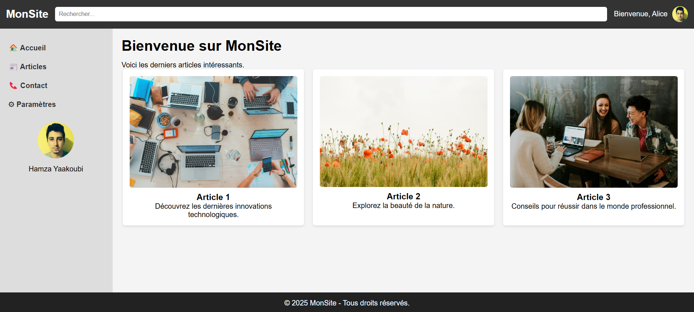

# Projet Flexbox

## Table des Matières
- [Introduction](#introduction)
- [Fonctionnalités](#fonctionnalités)
- [Installation](#installation)
- [Travail à faire](#travail-à-faire)

## Introduction
Ce projet démontre l'utilisation de CSS Flexbox pour créer des mises en page web réactives. Flexbox est un module de mise en page puissant qui permet de créer des mises en page complexes avec un minimum de code.

## Fonctionnalités
- Design réactif
- Facile à utiliser et à personnaliser
- Compatibilité multi-navigateurs
- Mise en page propre et moderne

## Installation
Pour commencer avec ce projet, clonez le dépôt sur votre machine locale en utilisant la commande suivante :
```bash
git clone https://github.com/YaakoubiMohamed/flexbox.git
```
Accédez au répertoire du projet :
```bash
cd flexbox-project
```

## Travail à faire

créer une page html comme l'image ci-dessous
